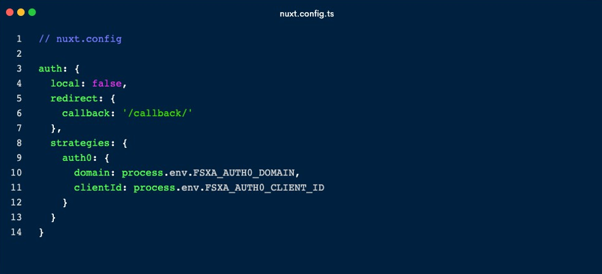
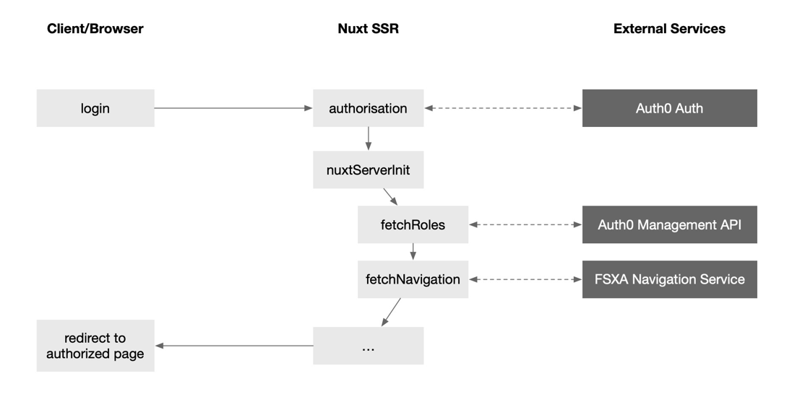

# SmartLiving APP

The SmartLiving APP is a reference project and can be used as basis for developing your own PWA.

## Getting Started

### Create `.env` file in root-directory

```bash
# APIKey used for authentication against the CaaS
FSXA_API_KEY= ...
# Auth0 settings for login. See documentation below
FSXA_AUTH0_CLIENT_ID= ...
FSXA_AUTH0_DOMAIN= ...
FSXA_AUTH0_M2M_CLIENT_ID= ...
FSXA_AUTH0_M2M_CLIENT_SECRET_ID= ...
# URL pointing to your CaaS Instance
FSXA_CAAS= ...
# ID of your master project for the news
FSXA_CORPORATE_PROJECT_ID= ...
# Enable or disable login (on/off)
FSXA_EDITOR_MODE= ...
# Application port. Mandatory for the websocket connection
FSXA_PORT= ...
# Base link of the application. Mandatory for the websocket connection
FSXA_HOST= ...
# ID of your project
FSXA_PROJECT_ID= ...
# URL pointing to the NavigationService
FSXA_NAVIGATION_SERVICE= ...
# Which mode should be used? (preview/release)
FSXA_MODE= ...
# KEY:VALUE map where semicolon is used as separator (key:uuid;key:uuid)
FSXA_REMOTES= ...
# This tenantId is required, when using caas-connect module 3.0.9 and above
FSXA_TENANT_ID= ...

```

### How to run dev and build mode

```bash
# install dependencies
$ npm install

# serve with hot reload at localhost:3000
$ npm run dev

# build for production and launch server
$ npm run build
$ npm run start

# generate static project
$ npm run generate
```

This project is using the [FSXA-Pattern-Library](https://www.npmjs.com/package/fsxa-pattern-library).
The pattern-library is referenced in two entry points.

### /src/pages/\_.tsx

The page structure in nuxt is mapped via files and folders inside of the pages folder. To leave the routing decision all requests are mapped to the generic IndexPage (\_.tsx) file. This will pass the current route to the FSXAPage. If the FSXAPage decides that a route-change is needed it will call the provided callback `handleRouteChange` with the next route and the IndexPage will pass it through the the router that is embedded in nuxt.


### /src/store/index.ts

Nuxt is calling the action `nuxtServerInit` in the client hydration process. To pipe the input through to the pattern-library the `index.ts` exists and is listening to the `nuxtServerInit`. The payload is passed through to the `FSXAActions.setInitialStateFromServer`.


### Adding new Section Templates

It is very easy to add new section templates. Just create your own template in the components-folder and make sure that you extends the `FSXABaseSection` provided by the FSXA-Pattern-Library.

```bash
# /src/components/MyNewSectionTemplate.jsx

import { FSXABaseSection } from "fsxa-pattern-library"
```

### Authentication & Autorisation

The nuxt/auth module is used for authentication. The module authenticates users via a configurable authentication scheme or via one of the directly supported providers - in this case: auth0 - it is a popular and easily accessible/implementable authentication and authorization platform.
* https://auth.nuxtjs.org
* https://auth0.com

There are several authentication workflows available:
* Universal Login: redirect to auth0 and enter user credentials. 
* Embedded login: using an auth0 react login widget directly on the page.
Each solution has its own advantages and disadvantages - see a comparison here: https://auth0.com/docs/authenticate/login/universal-vsembedded-login

In the SmartLving App, we use the embedded login with the lib/dependency: auth0-lock
Auth0 basic setup
* Login at: https://auth0.com/
* Create a new application - type: Single Page Web Application (Applications -> Applications).

Configure application:
* Allowed callback URLs - after login user will be redirected back to this URL - e.g. http://localhost:3000/callback. This page must also be configured in Nuxt auth config
* Allowed logout URLs - a set of URLs that are allowed to be redirected to this page after Auth0 logout.
* Allowed web origins - allowed origins for use with cross-origin authentication.
* Allowed origins (CORS) - URLs that are allowed to make requests from JavaScript to Auth0 API.

Using the credentials provided on the application page, customize the .env file in the project directory:
* FSXA_AUTH0_CLIENT_ID
* FSXA_AUTH0_DOMAIN

Embedded Login
* Ensure auth0-lock is installed: npm install auth0-lock - component location / auth0lock config: 
components/fsxa/ui/Login.tsx::getLock()
* Language and theme customizations can be applied - for a full configuration reference look here: https://auth0.com/docs/libraries/lock/lock-configuration
* Required .env variables:
* FSXA_AUTH0_CLIENT_ID
* FSXA_AUTH0_DOMAIN

### Embedded login limits

When using the embedded login form, the user's credentials are sent from one site (nuxt application) to another (auth0 auth application). When on different domains, auth0 third-party cookies are blocked by some browsers. For example, this affects mobile browsers on iPhone like Safari or Chrome.
There are several possible solutions:
* Using the paid auth0 premium feature "Custom Domains" - this makes it possible to run the auth0 auth application on the nuxt application domain.
* Creation and linking of a cross-origin verification page that enables cross-origin authentication in a limited number of browsers even with third-party cookies disabled.
* If the nuxt application is used for demo purposes only, the third-party cookie feature can be disabled in the respective browser setting.
See also: https://auth0.com/docs/authenticate/login/cross-origin-authentication

### Nuxt Setup



Auth0 configuration in nuxt.config.ts

Full Reference: https://auth.nuxtjs.org/providers/auth0

### Authorization

In the SmartLiving App, the accessible pages and permissions are held and edited in FirstSprit . Users with assigned roles are configured and managed in auth0.



Auth0 Management API Setup
To access user roles, user and app metadata, an api (-call) is also required:
* Auth0 login
* Create new "Management API" (Applications -> APIs)
* Identifier
* Create new "Application" of type "Machine to Machine Applications".
(Applications -> Applications)
* Select the previously added Management API

Using the credentials provided on the application page, customize the .env file in the project directory:

* FSXA_AUTH0_M2M_CLIENT_ID 
* FSXA_AUTH0_M2M_CLIENT_SECRET_ID
 
Since this is a machine-to-machine API, we cannot call it directly from the frontend. So we need to use a server middleware or call it somewhere in the nuxt ssr (server-side-rendering) context - e.g. during initial page rendering inside the 'nuxtServerInit' (store/action) hook store/index.ts.

In the FirstSpirit backend (e.g. Content Creator), access permissions can be set at page level. A number of roles are defined in the backend - e.g. group_standard, group_advanced, and group_premium. The same roles are also defined in the auth0 user management. The nuxt application matches both sides and decides what the currently authenticated user is allowed to do.


## Legal Notices

The SmartLiving App is a reference of [Crownpeak Technology GmbH](https://www.crownpeak.com/), Dortmund, Germany.
The SmartLiving App is subject to the Apache-2.0 license.

## Disclaimer

This document is provided for information purposes only. Crownpeak Technology may change the contents hereof without notice. This document is not warranted to be error-free, nor subject to any other warranties or conditions, whether expressed orally or implied in law, including implied warranties and conditions of merchantability or fitness for a particular purpose. Crownpeak Technology specifically disclaims any liability with respect to this document and no contractual obligations are formed either directly or indirectly by this document. The technologies, functionality, services, and processes described herein are subject to change without notice.
